# ETF Crash Alert

This serverless application monitors ETFs for potential market crashes using Bollinger Bands analysis.

## Architecture

```mermaid
architecture-beta
    group monitoring(logos:aws-lambda)[ETF Monitoring Stack]
        service yahoo(internet)[Yahoo Finance API] in monitoring
        service scheduler(logos:aws-eventbridge)[EventBridge Scheduler] in monitoring
        service analyzer(logos:aws-lambda)[Lambda Analyzer] in monitoring
        service logs(logos:aws-cloudwatch)[CloudWatch Logs] in monitoring
        service telegram(internet)[Telegram Alerts] in monitoring

        yahoo:B --> T:analyzer
        scheduler:R --> L:analyzer
        analyzer:R --> L:logs
        analyzer:B --> T:telegram
```

## Components

- **EventBridge Rule**: Triggers the Lambda function every weekday at 11:00 AM (cron: 0 11 ? * MON-FRI *)
- **Lambda Function**: Executes the Bollinger Bands analysis on ETF data and sends alerts when price drops below threshold
- **CloudWatch Logs**: Stores execution logs from the Lambda function
- **IAM Role**: Provides necessary permissions for Lambda execution
- **S3 Bucket**: Stores the Lambda deployment package
- **Yahoo Finance**: Data source for ETF prices (SWDA.MI)
- **Telegram Bot**: Sends notifications when price drops below the lower Bollinger Band margin

[CloudFormation Stack](https://eu-south-1.console.aws.amazon.com/cloudformation/home?region=eu-south-1#/stacks/resources?filteringText=&filteringStatus=active&viewNested=true&stackId=arn%3Aaws%3Acloudformation%3Aeu-south-1%3A778425763547%3Astack%2Fswda-etf-crash-alert-prod%2Feb1703e0-a9ba-11ef-bfde-0e287014c749)
